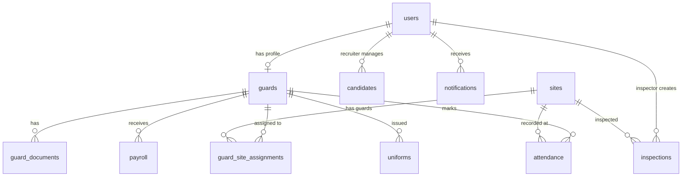

# Database Schema Documentation

## Entity Relationship Diagram

## Tables

### users
All system users across 4 roles.

| Column | Type | Constraints |
|--------|------|------------|
| id | UUID | PK, auto-generated |
| name | VARCHAR(255) | NOT NULL |
| phone | VARCHAR(15) | UNIQUE, NOT NULL |
| role | VARCHAR(20) | CHECK: admin, manager, recruiter, guard |
| is_active | BOOLEAN | DEFAULT true |
| fcm_token | TEXT | Firebase Cloud Messaging token |
| avatar_url | TEXT | Profile photo URL |
| created_at | TIMESTAMPTZ | DEFAULT NOW() |
| updated_at | TIMESTAMPTZ | Auto-updated via trigger |

### guards
Extended profile for security guards. Links to `users` table.

| Column | Type | Constraints |
|--------|------|------------|
| id | UUID | PK |
| user_id | UUID | FK → users.id, UNIQUE |
| aadhaar_number | VARCHAR(12) | Optional |
| pan_number | VARCHAR(10) | Optional |
| address | TEXT | |
| photo_url | TEXT | |
| height | DECIMAL(5,2) | In centimeters |
| weight | DECIMAL(5,2) | In kilograms |
| education | VARCHAR(100) | |
| police_verification | BOOLEAN | DEFAULT false |
| base_salary | DECIMAL(10,2) | NOT NULL |
| joining_date | DATE | |
| shift_type | VARCHAR(20) | CHECK: day, night, rotational |
| emergency_contact_name | VARCHAR(255) | |
| emergency_contact_phone | VARCHAR(15) | |
| bank_account_number | VARCHAR(20) | |
| bank_ifsc | VARCHAR(11) | |
| bank_name | VARCHAR(100) | |
| employment_status | VARCHAR(20) | CHECK: active, inactive, terminated |

### sites
Client locations where guards are deployed.

| Column | Type | Constraints |
|--------|------|------------|
| id | UUID | PK |
| site_name | VARCHAR(255) | NOT NULL |
| client_name | VARCHAR(255) | |
| address | TEXT | NOT NULL |
| latitude | DECIMAL(10,8) | NOT NULL |
| longitude | DECIMAL(11,8) | NOT NULL |
| geofence_radius | INT | DEFAULT 100 (meters) |
| day_shift_start | TIME | DEFAULT 08:00 |
| day_shift_end | TIME | DEFAULT 20:00 |
| night_shift_start | TIME | DEFAULT 20:00 |
| night_shift_end | TIME | DEFAULT 08:00 |
| contact_person | VARCHAR(255) | |
| contact_phone | VARCHAR(15) | |
| is_active | BOOLEAN | DEFAULT true |

### attendance
GPS + selfie verified check-in/check-out records.

| Column | Type | Constraints |
|--------|------|------------|
| id | UUID | PK |
| guard_id | UUID | FK → guards.id |
| site_id | UUID | FK → sites.id |
| shift_type | VARCHAR(10) | CHECK: day, night |
| check_in_time | TIMESTAMPTZ | |
| check_out_time | TIMESTAMPTZ | |
| check_in_selfie | TEXT | Storage URL |
| check_out_selfie | TEXT | Storage URL |
| check_in_latitude | DECIMAL(10,8) | |
| check_in_longitude | DECIMAL(11,8) | |
| hours_worked | DECIMAL(4,2) | Auto-calculated on checkout |
| status | VARCHAR(20) | CHECK: present, late, half_day, absent |
| is_manual_entry | BOOLEAN | DEFAULT false |
| attendance_date | DATE | DEFAULT CURRENT_DATE |

### payroll
Monthly salary calculations per guard.

| Column | Type | Notes |
|--------|------|-------|
| id | UUID | PK |
| guard_id | UUID | FK → guards.id |
| month | VARCHAR(7) | Format: '2026-05' |
| total_working_days | INT | Calendar days in month |
| days_present | INT | From attendance count |
| base_salary | DECIMAL(10,2) | Guard's base salary |
| pro_rated_salary | DECIMAL(10,2) | (base / total) × present |
| overtime_amount | DECIMAL(10,2) | |
| penalty_amount | DECIMAL(10,2) | |
| uniform_deduction | DECIMAL(10,2) | |
| advance_deduction | DECIMAL(10,2) | |
| final_salary | DECIMAL(10,2) | Net payable |
| status | VARCHAR(20) | draft → generated → approved → paid |

## Key Database Functions

| Function | Purpose |
|----------|---------|
| `calculate_distance(lat1, lon1, lat2, lon2)` | Haversine distance in meters |
| `is_within_geofence(lat, lon, site_id)` | Check if coords are within site fence |
| `get_daily_attendance_summary(date)` | Site-wise attendance counts |
| `get_guard_monthly_attendance(guard_id, month)` | Monthly attendance stats |
| `get_business_days(month)` | Total days in a month |

## Key Triggers

| Trigger | Table | Purpose |
|---------|-------|---------|
| `set_updated_at_*` | All tables | Auto-update `updated_at` on modification |
| `trg_deactivate_prev_assignments` | guard_site_assignments | Ensures 1 active assignment per guard |
| `trg_validate_checkin` | attendance | Prevents duplicate check-ins |
| `trg_calculate_hours` | attendance | Auto-calculates hours on checkout |
