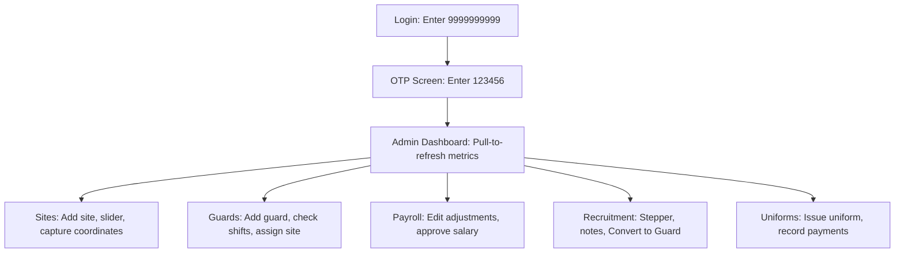

# Expo UI Testing Guide

This guide provides a step-by-step walkthrough for running and testing the **Pan India Security** React Native app on a physical mobile device or emulator/simulator using **Expo Go**.

---

## 🛠️ Step 1: Install Expo Go or a Simulator

To run the application, you can use either a physical phone (recommended for testing GPS geofences and camera uploads) or a virtual device.

### Option A: Physical Device (Recommended)
1. **Download Expo Go**:
   - [Android (Google Play Store)](https://play.google.com/store/apps/details?id=host.exp.exponent)
   - [iOS (Apple App Store)](https://apps.apple.com/app/expo-go/id982107779)
2. **Wi-Fi Connection Check**:
   - ⚠️ **Important**: Your mobile phone and your computer MUST be connected to the **same Wi-Fi network**. If you are using a corporate/restricted router or mobile hotspot, check the troubleshooting section below.

### Option B: Local Simulator/Emulator
* **iOS Simulator** (Mac only): Install Xcode from the Mac App Store.
* **Android Emulator** (Windows/Mac/Linux): Install Android Studio, open the Device Manager, and run a Virtual Device (AVD).

---

## ⚙️ Step 2: Verify Your Environment Configuration

The application is fully pre-configured to communicate with the live Supabase cloud database.

Verify that [mobile/.env](file:///c:/Users/KIIT/Desktop/PAN_INDIA_SECURITY/mobile/.env) contains the following active endpoints:
```env
EXPO_PUBLIC_SUPABASE_URL=https://fuztfltbokbnfcvotrrp.supabase.co
EXPO_PUBLIC_SUPABASE_ANON_KEY=eyJhbGciOiJIUzI1NiIsInR5cCI6...
```
*(No local Supabase server needs to be running since the app queries the cloud instance directly!)*

---

## 🚀 Step 3: Start the Metro Bundler

A Metro Bundler instance is already active, but you can restart it anytime if needed.

1. Open a terminal in the `mobile` workspace directory:
   ```bash
   cd mobile
   ```
2. Launch Expo:
   ```bash
   npm run start
   ```
   *Or, to start with a fresh, clear cache:*
   ```bash
   npx expo start --clear
   ```
3. Once loaded, you will see a large QR Code printed in the terminal, along with key commands:
   * Press `a` to open on an Android emulator.
   * Press `i` to open on an iOS simulator.
   * Press `r` to reload the bundle.
   * Press `d` to open the developer menu.

---

## 📱 Step 4: Scan and Launch the App

### On Android
* Open the **Expo Go** app.
* Tap **"Scan QR Code"** and scan the code displayed in your computer terminal.

### On iOS
* Open the default iOS **Camera** app.
* Scan the QR Code, then tap the **"Open in Expo Go"** banner.

---

## 🔑 Step 5: Test the Authentication Bypass

Because the staging environment has SMS dispatching disabled, we have integrated a custom OTP bypass logic inside the `auth-verify-otp` Edge Function. Use the following seeded accounts to test different roles:

### Seed Credentials Matrix

| Role | Phone Number to Enter | OTP Verification Code |
| :--- | :--- | :--- |
| **Admin** | `9999999999` | **`123456`** (or `000000`) |
| **Manager** | `9888888881` | **`123456`** (or `000000`) |
| **Recruiter** | `9888888883` | **`123456`** (or `000000`) |
| **Guard** | `9777777771` | **`123456`** (or `000000`) |

### Verification Flow
1. Open the app $\rightarrow$ You will see the animated Splash Screen before redirecting to the **Login** screen.
2. Enter `9999999999` and tap **Send OTP**.
3. On the **OtpVerification** screen, input **`123456`** and tap **Verify**.
4. You will see a green verification success animation and immediately route to the **Admin Dashboard**.

---

## 🧪 Step 6: Screen-by-Screen Test Checklist

Once logged in as an Admin, execute the following UI testing checklist to confirm all modules load and process data correctly.



### 1. Admin Dashboard
* Verify stats counters (Active Guards, Site Coverage, Today's Attendance) load dynamically.
* Pull down on the dashboard to trigger **pull-to-refresh** and observe the refresh indicator.
* Tap the Notification bell in the top right to verify navigation to the **Notification Center**.

### 2. Sites & Geofencing
* Navigate to the **Sites** tab in the bottom bar.
* Tap the floating **"+" (Add Site)** button.
* Enter a mock site name, client name, and address.
* Tap **"Capture Current GPS"** to verify the coordinates are automatically resolved.
* Move the **Geofence Radius** slider (from 50m to 500m) and notice the badge recalculate values.
* Save the site and confirm it appears immediately in the active directory list.

### 3. Guards Directory
* Navigate to the **Guards** tab in the bottom bar.
* Tap a guard profile card (e.g. *Rajesh Kumar*) to view the **Guard Details**.
* Tap **"Verify Documents"** or check the active day/night shift assignments.
* Go back, tap **"+" (Add Guard)**, and fill out the details (Phone, Salary Base, Height) to verify adding a new guard to the system.
* Tap **"Assign Guard"** to map a guard to a specific security site.

### 4. Payroll & Salary Slips
* Navigate to the **More Menu** (bottom tab) $\rightarrow$ Tap **Payroll**.
* Tap a Salary Slip row to open the detailed breakdown.
* Tap **"Edit Adjustments"** (the pencil icon or button) to open the interactive calculator modal:
  * Change "Present Days" or "Overtime Hours".
  * Notice the **Net Salary** automatically recalculate in real-time in the modal.
  * Tap **Save** and verify the main screen cards update instantly.
* Tap **"Approve Payment"** and check if the badge status changes to `APPROVED`.

### 5. Recruitment Pipeline
* Navigate to **More Menu** $\rightarrow$ Tap **Recruitment**.
* Swipe the top stats carousel (New, In Progress, Selected, Hired).
* Tap a candidate card to view the **Candidate Details**.
* Verify the **Pipeline Stepper** highlights the active stage.
* Tap **"Add Note"**, type a message, and save. Verify the new note appears in the timeline with a correct timestamp.
* Tap **"Update Status"** to advance the candidate through the stepper.
* Tap **"Convert to Guard"** to automatically upgrade the applicant and view the success dialog.

### 6. Uniform Inventory
* Navigate to **More Menu** $\rightarrow$ Tap **Uniforms**.
* Verify total pending and collected amounts calculate at the top.
* Tap **Record Payment** on a pending item, enter an amount, and check if the state changes to `PARTIAL` or `PAID`.
* Tap **"+ Issue Uniform"**, select a guard/item, and verify the record is added to the inventory tracker.

---

## 🔍 Step 7: Debugging & Developer Tools

If you experience layout glitches or need to inspect console messages:

1. **Open the Developer Menu**:
   - **Physical Device**: Shake the phone or tap the Expo icon in the notification tray.
   - **Simulator/Emulator**: Press `d` in the terminal, or `Cmd+D` (iOS) / `Ctrl+M` (Android).
2. **Key Options inside Developer Menu**:
   - **Reload**: Re-compiles your JS code bundle.
   - **Show Element Inspector**: Inspect visual padding, colors, and layout flex structures.
   - **Toggle Performance Monitor**: Check FPS and RAM consumption.

---

## 🚨 Troubleshooting

### 1. Metro Bundler fails to connect (Red/Blue Screen on device)
* **Verify Wi-Fi**: Check that both the PC and the phone are on the exact same Wi-Fi SSID.
* **Firewall Blocks**: Windows Defender Firewall can sometimes block connection requests to port `8081`. 
  - Change your Network profile on Windows from **Public** to **Private**.
  - Or, run Metro in Tunnel mode by executing:
    ```bash
    npx expo start --tunnel
    ```
    *(Note: Using `--tunnel` uses an ngrok bypass and does not require sharing the same Wi-Fi connection!)*

### 2. "Network request failed" during login
* Ensure your computer has internet access. The app talks directly to the live Supabase cloud API (`https://fuztfltbokbnfcvotrrp.supabase.co`).
* Check if your company VPN or proxy is blocking outbound HTTPS requests to Supabase.

### 3. Clear Metro Cache
* If compilation gets stuck or doesn't show your latest edits, terminate Metro (`Ctrl+C`) and run:
  ```bash
  npx expo start --clear
  ```
